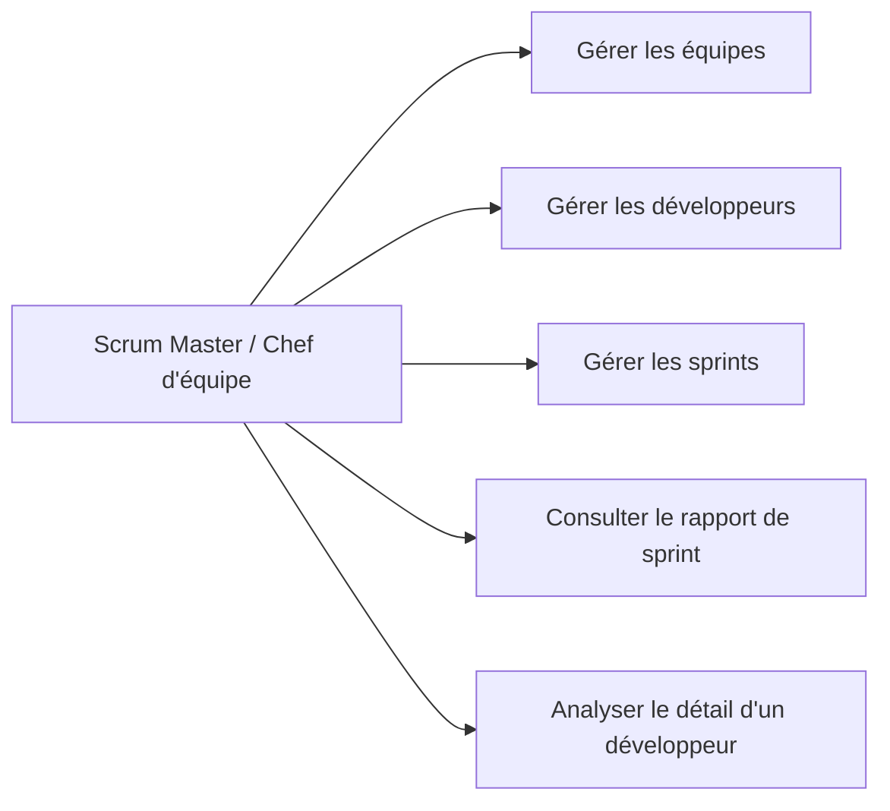
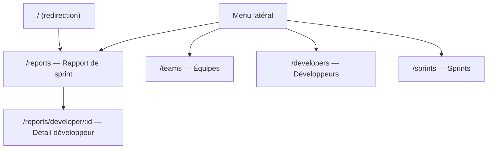
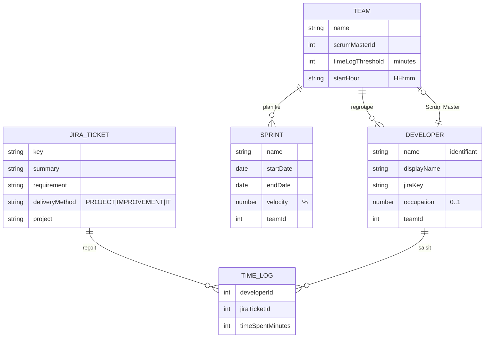
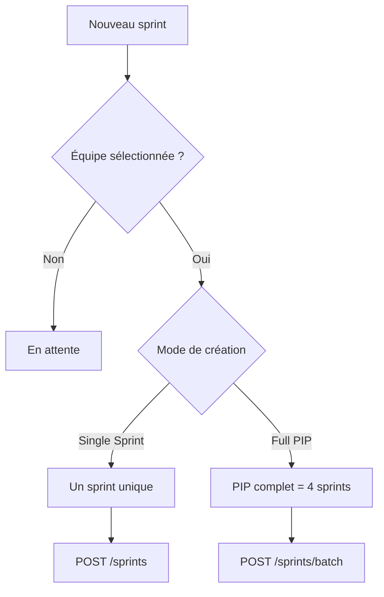
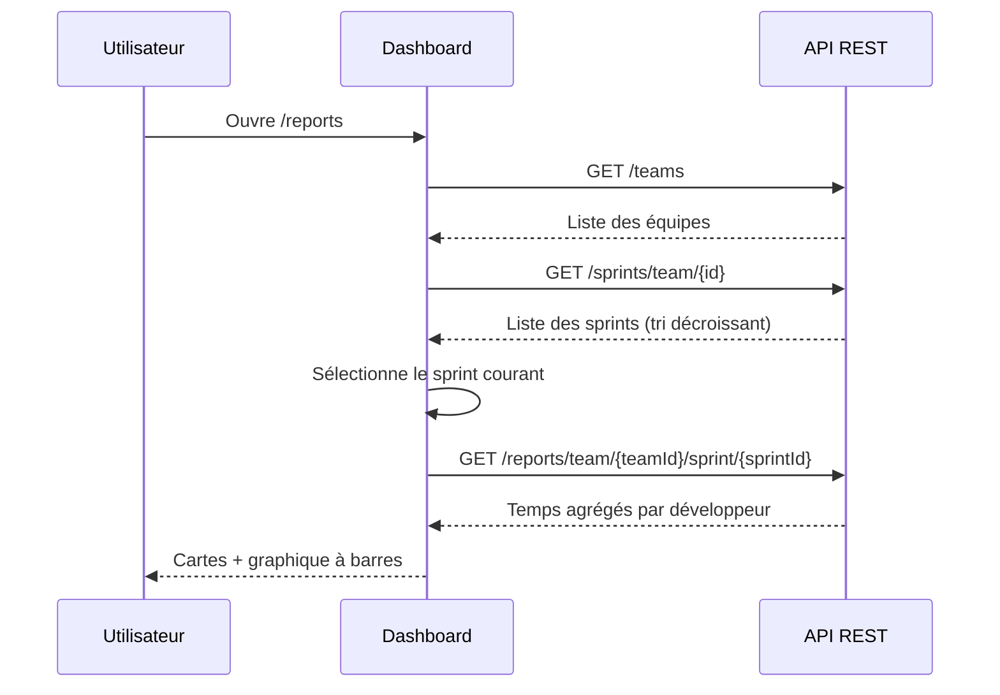
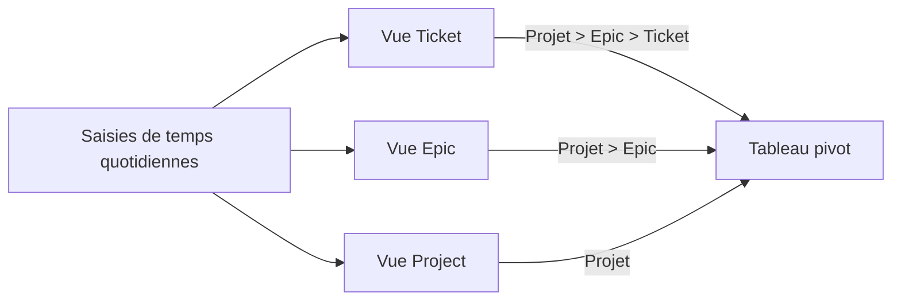
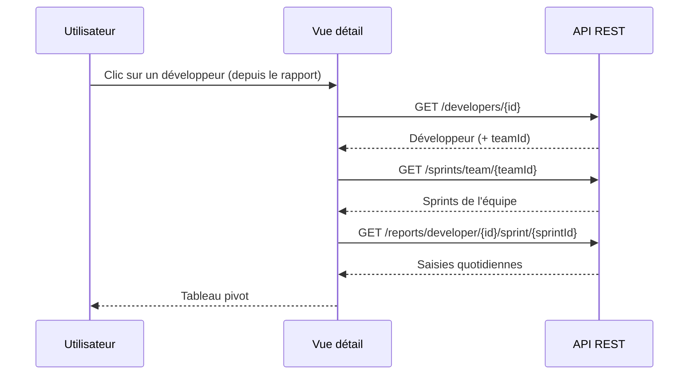

# Documentation fonctionnelle — Front-end Scrum Assistant

> Application web de suivi du temps passé par les développeurs sur les tickets Jira,
> au sein des sprints d'une équipe Scrum.

---

## 1. Présentation générale

**Scrum Assistant** est une interface de gestion et de reporting destinée aux
Scrum Masters et chefs d'équipe. Elle permet de :

- gérer le référentiel des **équipes**, **développeurs** et **sprints** ;
- consulter des **rapports de temps** agrégés par sprint et par développeur ;
- visualiser la **charge réelle** des développeurs comparée à leur capacité théorique.

L'application est un *front* Angular qui consomme une API REST. Elle ne contient
aucune logique de persistance : toutes les données proviennent du back-end.

| Caractéristique | Valeur |
|-----------------|--------|
| Framework | Angular 21 (composants *standalone*, signals) |
| Librairie UI | Angular Material 21 |
| Localisation | Français (`fr-FR`) |
| API consommée | `http://localhost:8080/api/ui` (environnement de dév.) |
| Thème | Clair / Sombre, persistant via `localStorage` |

---

## 2. Acteurs et cas d'usage



L'application ne gère pas de comptes utilisateurs ni d'authentification :
toute personne accédant à l'interface dispose des mêmes droits.

---

## 3. Structure de navigation

La navigation se fait via un menu latéral permanent. La page d'accueil
redirige vers les **Rapports**.



| Entrée de menu | Route | Icône | Rôle |
|----------------|-------|-------|------|
| Reports | `/reports` | `bar_chart` | Tableau de bord des temps de sprint |
| Teams | `/teams` | `groups` | Référentiel des équipes |
| Developers | `/developers` | `person` | Référentiel des développeurs |
| Sprints | `/sprints` | `event` | Référentiel des sprints |

> Note : l'écran « Détail développeur » n'est pas accessible depuis le menu ;
> on y accède en cliquant sur une ligne du rapport de sprint.
> Les *Jira Tickets* disposent de composants mais ne sont pas reliés au menu.

Le pied du menu propose un **basculement de thème** clair/sombre et affiche la
version applicative.

---

## 4. Entités fonctionnelles (modèle de données)



### 4.1 Équipe (Team)
Regroupe des développeurs et des sprints. Caractérisée par un **Scrum Master**
(un développeur), un **seuil de log de temps** en minutes et une **heure de
début de journée** (par défaut `09:30`).

### 4.2 Développeur (Developer)
Possède un nom technique, un nom d'affichage, une **clé Jira** et un
**taux d'occupation** (`occupation`). L'occupation est stockée en fraction
(`0,7`) mais saisie et affichée en pourcentage (`70 %`).

### 4.3 Sprint
Itération datée, rattachée à une équipe, avec une **vélocité** en pourcentage.
Le sprint dont la période englobe la date courante est le **sprint courant**.

### 4.4 Ticket Jira
Élément de travail (`PROJ-123`) classé par **méthode de livraison** :
`PROJECT`, `IMPROVEMENT` ou `IT`. Porte des saisies de temps.

### 4.5 Saisie de temps (TimeLog)
Lie un développeur à un ticket Jira pour une durée en minutes.

---

## 5. Modules fonctionnels

### 5.1 Gestion des équipes (`/teams`)

Tableau triable listant les équipes (Nom, Scrum Master, Seuil, Heure de début).
Actions : créer, modifier, supprimer.

Le formulaire (boîte de dialogue) propose :
- **Nom** (obligatoire) ;
- **Scrum Master** : choisi parmi les développeurs existants ;
- **Seuil de log de temps** : par défaut `360` minutes ;
- **Heure de début** : par défaut `09:30`.

### 5.2 Gestion des développeurs (`/developers`)

Tableau triable (Nom, Clé Jira, Occupation, Équipe). L'occupation s'affiche en
pourcentage. Actions : créer, modifier, supprimer.

Le formulaire propose Nom d'utilisateur (obligatoire), Nom d'affichage,
Clé Jira, Occupation (%) et Équipe d'affectation. La conversion
pourcentage ↔ fraction est faite à l'enregistrement (`70` → `0,7`).

### 5.3 Gestion des sprints (`/sprints`)

Tableau triable (Nom, Équipe, Dates, Vélocité). Le sprint courant est marqué
d'une puce **« Current »**. Actions : créer, modifier, supprimer.

Le formulaire de création offre **deux modes** :



#### Mode « Single Sprint »
Crée un sprint unique. Le nom, la date de début et la vélocité sont
**pré-remplis automatiquement** à partir du dernier sprint de l'équipe.

#### Mode « Full PIP »
Crée un **PIP** (Program Increment) de **4 sprints** d'un coup :
- sprints 1 à 3 : durée de **2 semaines** ;
- sprint 4 : durée de **1 semaine**.

Les noms suivent la convention `Équipe_AA_PIPn_Sn`
(ex. `TeamA_26_PIP3_S1`). L'année, le numéro de PIP et le numéro de sprint
sont déduits automatiquement du dernier sprint existant.

**Règles de nommage et d'enchaînement :**

| Situation | Comportement |
|-----------|--------------|
| Aucun sprint existant | PIP 1, Sprint 1, année de la date de début |
| Dernier sprint S1–S3 | Même PIP, sprint suivant (Single) |
| Dernier sprint S4, même année | PIP suivant |
| Dernier sprint S4, année différente | PIP 1 de la nouvelle année |
| Date de début du nouveau sprint | Date de fin du dernier sprint, sinon lundi suivant |

L'heure de chaque date est fixée à l'**heure de début de l'équipe**.

### 5.4 Tickets Jira

Des composants de liste et de formulaire existent (clé, résumé, exigence,
méthode de livraison, projet) mais **ne sont pas exposés** dans la navigation
actuelle.

---

## 6. Module de reporting

### 6.1 Rapport de sprint (`/reports`)

Écran principal de l'application. L'utilisateur choisit une **équipe** et un
**sprint** ; le sprint courant est présélectionné.



Le rapport affiche :

1. **Trois cartes de synthèse** : nombre de développeurs, temps total loggé,
   moyenne par développeur.
2. **Un graphique « Temps loggé par développeur »** : une barre de progression
   par développeur, avec une ventilation par méthode de livraison
   (puces `PROJECT` / `IMPROVEMENT` / `IT`).

**Taux de complétion d'une barre** — la largeur de barre représente le rapport
entre temps réellement loggé et temps attendu :

```
temps attendu = jours_ouvrés × 8 h × 60 min × occupation
complétion (%) = min(100, temps_loggé / temps_attendu × 100)
```

où `jours_ouvrés` est le nombre de jours du sprint hors week-ends, et
`occupation` le taux d'occupation du développeur (défaut `1`).

Un clic sur une ligne ouvre le **détail du développeur**, en transmettant le
sprint sélectionné.

### 6.2 Détail développeur (`/reports/developer/:id`)

Vue **tableau croisé** (pivot) du temps d'un développeur, jour par jour, sur
toute la durée d'un sprint (jours ouvrés uniquement).

L'utilisateur peut changer de sprint et choisir un **niveau d'agrégation** :



| Mode | Colonnes affichées | Regroupement |
|------|--------------------|--------------|
| **Project** | Projet | par projet |
| **Epic** | Projet, Epic | par projet + epic |
| **Ticket** | Projet, Epic, Ticket | une ligne par ticket |

- Les colonnes restantes représentent les **jours ouvrés** du sprint
  (en-tête `Lun 27/04`).
- Les cellules de projet/epic sont **fusionnées** (rowspan) quand elles se
  répètent.
- Une **ligne de total** récapitule le temps par jour.
- Les durées sont formatées en `h`/`min` (ex. `7h30`, `0h45`).



---

## 7. Interfaces API consommées

Toutes les requêtes ont pour base `environment.apiUrl` (`/api/ui`).

| Domaine | Méthode | Endpoint | Usage |
|---------|---------|----------|-------|
| Équipes | GET/POST/PUT/DELETE | `/teams`, `/teams/{id}` | CRUD équipes |
| Développeurs | GET | `/developers`, `/developers/{id}` | Lecture |
| Développeurs | GET | `/developers/team/{teamId}` | Par équipe |
| Développeurs | POST/PUT/DELETE | `/developers`, `/developers/{id}` | CRUD |
| Sprints | GET | `/sprints`, `/sprints/{id}` | Lecture |
| Sprints | GET | `/sprints/current` | Sprint courant |
| Sprints | GET | `/sprints/team/{teamId}` | Par équipe |
| Sprints | POST | `/sprints`, `/sprints/batch` | Création (simple / PIP) |
| Sprints | PUT/DELETE | `/sprints/{id}` | Mise à jour / suppression |
| Tickets Jira | GET/POST/PUT/DELETE | `/jira-tickets` | CRUD |
| Saisies de temps | GET/POST/PUT/DELETE | `/time-logs` | CRUD |
| Rapports | GET | `/reports/team/{teamId}/sprint/{sprintId}` | Rapport de sprint |
| Rapports | GET | `/reports/developer/{devId}/sprint/{sprintId}` | Détail développeur |

---

## 8. Comportements transverses

### 8.1 Gestion des erreurs
Un intercepteur HTTP capte toutes les erreurs et affiche un *snackbar* pendant
5 secondes :

| Cas | Message affiché |
|-----|-----------------|
| Erreur renvoyée par l'API (`error.message`) | message de l'API |
| Statut 404 | « Resource not found » |
| Statut 0 (serveur injoignable) | « Cannot connect to server » |
| Autre | « An unexpected error occurred » |

### 8.2 Notifications de succès
Les créations, modifications et suppressions affichent un *snackbar* de
confirmation (3 secondes).

### 8.3 Confirmation de suppression
Toute suppression passe par une boîte de dialogue de confirmation
(« Cancel » / « Confirm ») avant d'appeler l'API.

### 8.4 Thème clair / sombre
Le bouton du pied de menu bascule le thème. Le choix est mémorisé dans
`localStorage` (clé `sa-theme`) et appliqué via l'attribut `data-theme` du
document.

### 8.5 États vides
Lorsqu'aucune donnée n'est disponible (rapport sans temps loggé, détail sans
saisie), un message d'**état vide** illustré est affiché à la place du contenu.

---

## 9. Glossaire

| Terme | Définition |
|-------|------------|
| **Sprint** | Itération de travail datée, rattachée à une équipe. |
| **PIP** | *Program Increment Plan* — groupe de 4 sprints créés ensemble. |
| **Vélocité** | Capacité de l'équipe pour le sprint, en pourcentage. |
| **Occupation** | Taux de disponibilité d'un développeur (0 à 100 %). |
| **Méthode de livraison** | Catégorie du ticket : `PROJECT`, `IMPROVEMENT`, `IT`. |
| **Seuil de log de temps** | Quantité de minutes attendue par l'équipe. |
| **Heure de début** | Heure de début de journée de l'équipe (défaut `09:30`). |
| **Sprint courant** | Sprint dont la période englobe la date du jour. |
| **Jour ouvré** | Jour de semaine hors samedi et dimanche. |
