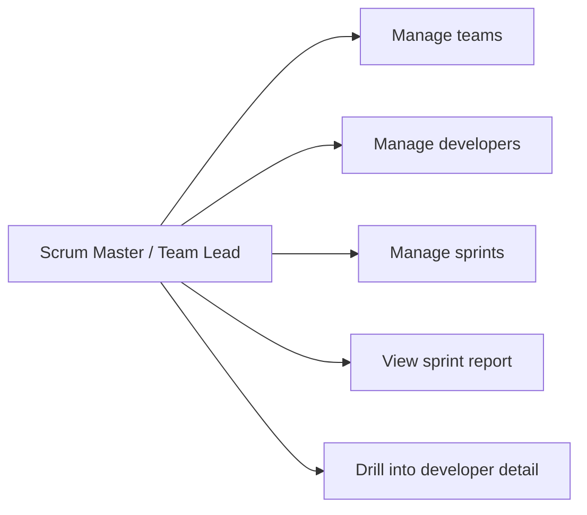
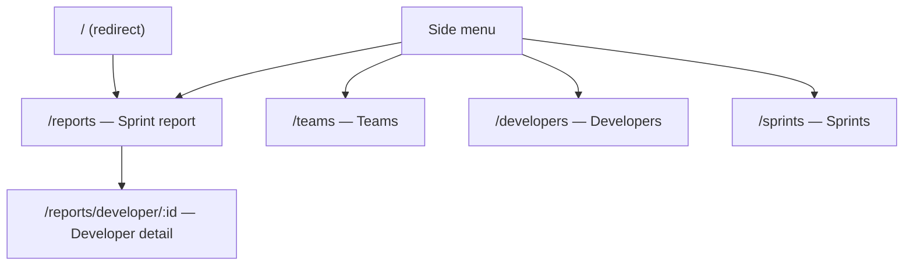
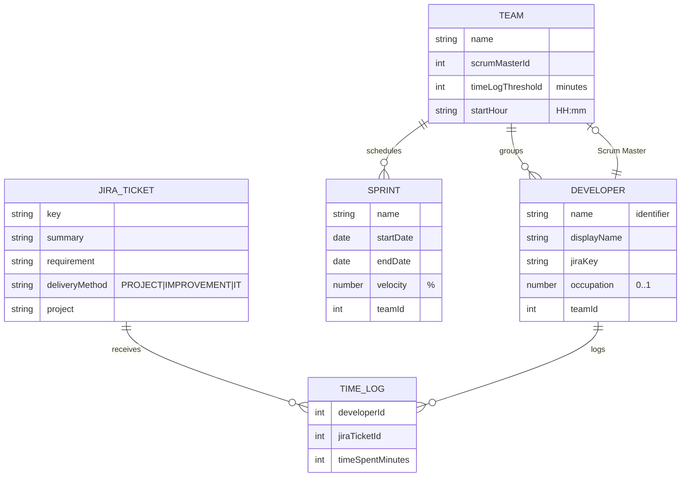
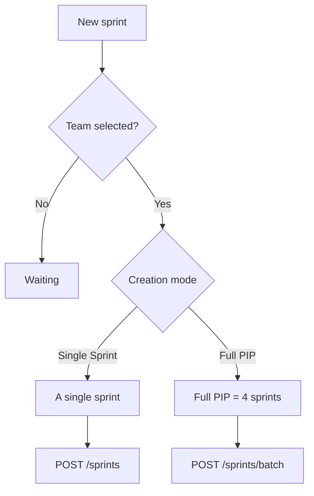
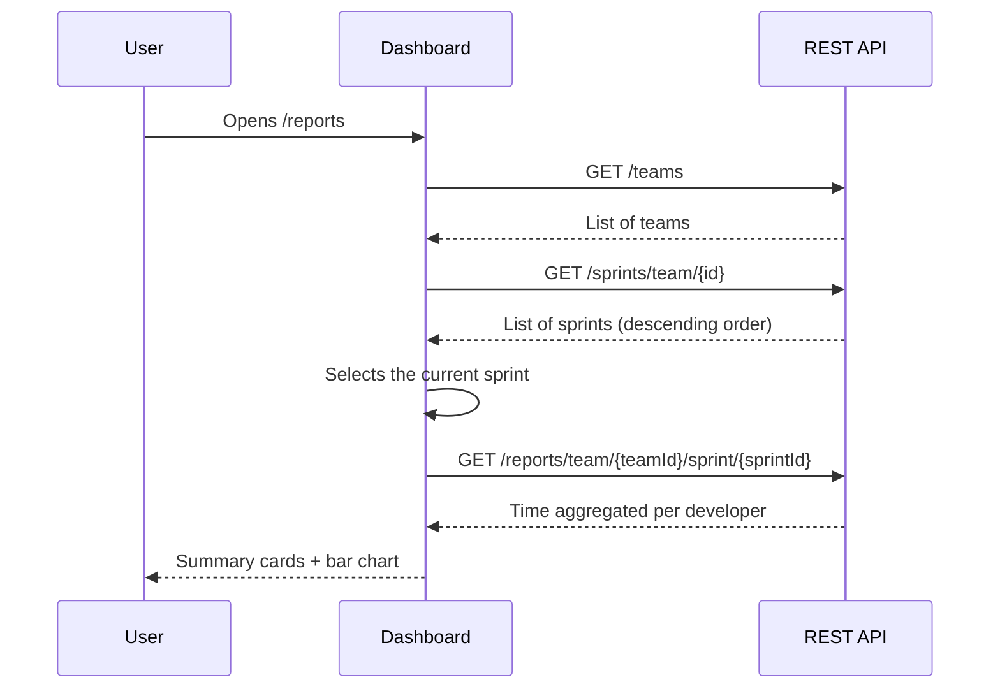
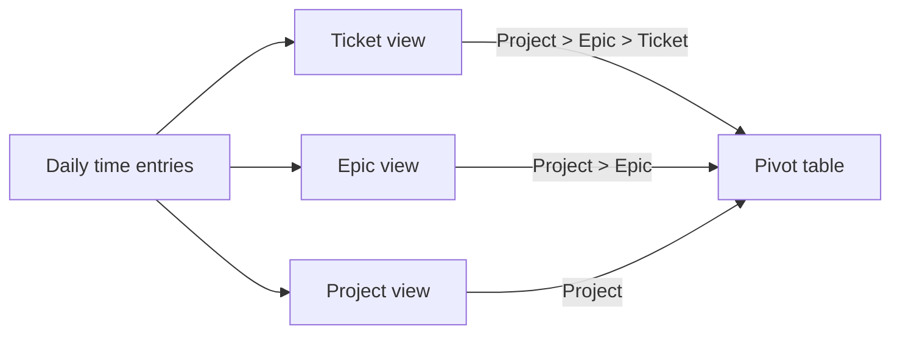
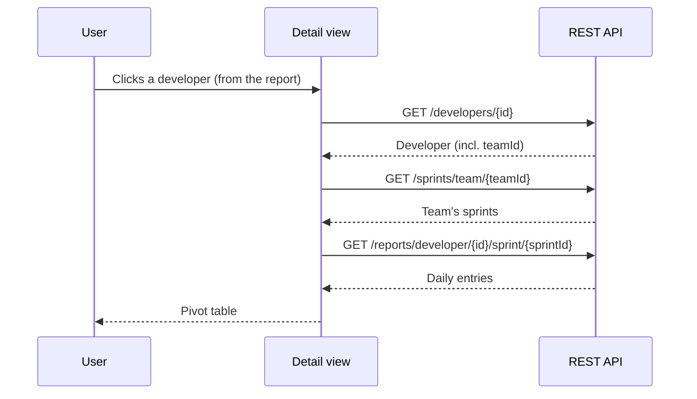

# Functional Documentation — Scrum Assistant Frontend

> Web application for tracking the time developers spend on Jira tickets,
> within the sprints of a Scrum team.

---

## 1. Overview

**Scrum Assistant** is a management and reporting interface for Scrum Masters
and team leads. It allows users to:

- manage the reference data for **teams**, **developers** and **sprints**;
- view **time reports** aggregated by sprint and by developer;
- visualize developers' **actual workload** against their theoretical capacity.

The application is an Angular *frontend* that consumes a REST API. It contains
no persistence logic: all data comes from the backend.

| Property | Value |
|----------|-------|
| Framework | Angular 21 (standalone components, signals) |
| UI library | Angular Material 21 |
| Localization | French (`fr-FR`) |
| Consumed API | `http://localhost:8080/api/ui` (dev environment) |
| Theme | Light / Dark, persisted via `localStorage` |

---

## 2. Actors and use cases



The application does not handle user accounts or authentication: anyone with
access to the interface has the same permissions.

---

## 3. Navigation structure

Navigation uses a permanent side menu. The home page redirects to **Reports**.



| Menu item | Route | Icon | Purpose |
|-----------|-------|------|---------|
| Reports | `/reports` | `bar_chart` | Sprint time dashboard |
| Teams | `/teams` | `groups` | Team reference data |
| Developers | `/developers` | `person` | Developer reference data |
| Sprints | `/sprints` | `event` | Sprint reference data |

> Note: the "Developer detail" screen is not reachable from the menu;
> it is opened by clicking a row in the sprint report.
> The *Jira Tickets* components exist but are not wired into the menu.

The menu footer provides a **light/dark theme toggle** and shows the
application version.

---

## 4. Functional entities (data model)



### 4.1 Team
Groups developers and sprints. Defined by a **Scrum Master** (a developer),
a **time log threshold** in minutes, and a **day start time**
(default `09:30`).

### 4.2 Developer
Has a technical name, a display name, an optional **email**, a **Jira key**
and an **occupation rate**. Occupation is stored as a fraction (`0.7`) but
entered and displayed as a percentage (`70%`).

### 4.3 Sprint
A dated iteration attached to a team, with a **velocity** as a percentage.
The sprint whose date range includes today is the **current sprint**.

### 4.4 Jira ticket
A work item (`PROJ-123`) classified by **delivery method**:
`PROJECT`, `IMPROVEMENT` or `IT`. Carries time entries.

### 4.5 Time log
Links a developer to a Jira ticket for a duration in minutes.

---

## 5. Functional modules

### 5.1 Team management (`/teams`)

A sortable table lists teams (Name, Scrum Master, Threshold, Start Hour).
Actions: create, edit, delete.

The dialog form offers:
- **Name** (required);
- **Scrum Master**: chosen from existing developers;
- **Time log threshold**: defaults to `360` minutes;
- **Start hour**: defaults to `09:30`.

### 5.2 Developer management (`/developers`)

A sortable table (Name, Email, Jira Key, Occupation, Team). Occupation is
displayed as a percentage; a missing email is rendered as `—`. Actions:
create, edit, delete.

The form provides Username (required), Display Name, **Email** (optional,
validated against the standard email format), Jira Key, Occupation (%) and
Team assignment. The percentage ↔ fraction conversion happens at save time
(`70` → `0.7`).

### 5.3 Sprint management (`/sprints`)

A sortable table (Name, Team, Dates, Velocity). The current sprint is marked
with a **"Current"** chip. Actions: create, edit, delete.

**Filters** (combined as AND, applied client-side):
- **Team** — restricts the table to sprints of the selected team.
- **PIP filter** — a single aggregated drop-down listing every distinct
  year and PIP found in the loaded sprints, in the form `All`,
  `26 (all PIPs)`, `26 / PIP3`, `26 / PIP2`, `25 (all PIPs)`, …. Years and
  PIPs are sorted most-recent first. The list is recomputed from the
  sprints of the currently selected team, so changing Team narrows the
  available PIP options (the selection falls back to `All` if it is no
  longer available). On screen load, the filter is pre-selected on the
  current year (e.g. `26` in 2026), or `All` if no sprint of that year is
  loaded. Sprints whose name does not follow the `Team_YY_PIPn_Sn`
  convention are excluded as soon as a PIP filter other than `All` is
  active.

The creation form supports **two modes**:



#### "Single Sprint" mode
Creates one sprint. Name, start date and velocity are
**pre-filled automatically** from the team's most recent sprint.

#### "Full PIP" mode
Creates a **PIP** (Program Increment) of **4 sprints** at once:
- sprints 1 to 3: **2 weeks** long;
- sprint 4: **1 week** long.

Names follow the convention `Team_YY_PIPn_Sn`
(e.g. `TeamA_26_PIP3_S1`). The year, PIP number and sprint number
are derived automatically from the latest existing sprint.

The **first sprint name is editable**: changing it propagates to the other
three (the suffix `_S1` is replaced by `_S2`, `_S3`, `_S4`; if the typed
name has no `_Sn` suffix, the indexed suffix is appended). The auto-derived
name is kept in sync with the start date as long as the field has not been
manually edited; changing team always resets the field.

**Naming and sequencing rules:**

| Situation | Behavior |
|-----------|----------|
| No existing sprint | PIP 1, Sprint 1, year from start date |
| Latest sprint is S1–S3 | Same PIP, next sprint number (Single mode) |
| Latest sprint is S4, same year | Next PIP |
| Latest sprint is S4, different year | PIP 1 of the new year |
| Start date of the new sprint | End date of the latest sprint, otherwise next Monday |

Each date's time is set to the team's **start hour**.

### 5.4 Jira tickets

List and form components exist (key, summary, requirement, delivery method,
project) but are **not exposed** in the current navigation.

---

## 6. Reporting module

### 6.1 Sprint report (`/reports`)

The main screen of the application. The user picks a **team** and a
**sprint**; the current sprint is pre-selected.



The report displays:

1. **Three summary cards**: number of developers, total logged time,
   average per developer.
2. **A "Time Logged by Developer" chart**: one progress bar per developer,
   with a breakdown by delivery method
   (`PROJECT` / `IMPROVEMENT` / `IT` chips).

**Bar completion percentage** — the bar width represents the ratio of time
actually logged to expected time:

```
expected time = business_days × 8 h × 60 min × occupation
completion (%) = min(100, logged_time / expected_time × 100)
```

where `business_days` is the number of weekdays in the sprint (excluding
weekends), and `occupation` is the developer's occupation rate (default `1`).

Clicking a row opens the **developer detail**, passing the selected sprint.

### 6.2 Developer detail (`/reports/developer/:id`)

A **pivot table** view of a developer's time, day by day, over the full
duration of a sprint (business days only).

The user can switch sprints and choose an **aggregation level**:



| Mode | Columns shown | Grouping |
|------|---------------|----------|
| **Project** | Project | by project |
| **Epic** | Project, Epic | by project + epic |
| **Ticket** | Project, Epic, Ticket | one row per ticket |

- Remaining columns represent the sprint's **business days**
  (header `Mon 27/04`).
- Project/epic cells are **merged** (rowspan) when they repeat.
- A **total row** sums up time per day.
- Durations are formatted as `h`/`min` (e.g. `7h30`, `0h45`).



---

## 7. Consumed API endpoints

All requests use `environment.apiUrl` (`/api/ui`) as their base.

| Domain | Method | Endpoint | Usage |
|--------|--------|----------|-------|
| Teams | GET/POST/PUT/DELETE | `/teams`, `/teams/{id}` | Team CRUD |
| Developers | GET | `/developers`, `/developers/{id}` | Read |
| Developers | GET | `/developers/team/{teamId}` | By team |
| Developers | POST/PUT/DELETE | `/developers`, `/developers/{id}` | CRUD |
| Sprints | GET | `/sprints`, `/sprints/{id}` | Read |
| Sprints | GET | `/sprints/current` | Current sprint |
| Sprints | GET | `/sprints/team/{teamId}` | By team |
| Sprints | POST | `/sprints`, `/sprints/batch` | Create (single / PIP) |
| Sprints | PUT/DELETE | `/sprints/{id}` | Update / delete |
| Jira tickets | GET/POST/PUT/DELETE | `/jira-tickets` | CRUD |
| Time logs | GET/POST/PUT/DELETE | `/time-logs` | CRUD |
| Reports | GET | `/reports/team/{teamId}/sprint/{sprintId}` | Sprint report |
| Reports | GET | `/reports/developer/{devId}/sprint/{sprintId}` | Developer detail |

---

## 8. Cross-cutting behaviors

### 8.1 Error handling
An HTTP interceptor catches every error and shows a snackbar for 5 seconds:

| Case | Displayed message |
|------|-------------------|
| Error returned by the API (`error.message`) | API message |
| Status 404 | "Resource not found" |
| Status 0 (server unreachable) | "Cannot connect to server" |
| Other | "An unexpected error occurred" |

### 8.2 Success notifications
Create, update and delete operations display a confirmation snackbar
(3 seconds).

### 8.3 Delete confirmation
Every deletion goes through a confirmation dialog
("Cancel" / "Confirm") before the API call is made.

### 8.4 Light / dark theme
The footer button toggles the theme. The choice is stored in
`localStorage` (key `sa-theme`) and applied via the document's
`data-theme` attribute.

### 8.5 Empty states
When no data is available (sprint report with no logged time, detail with no
entries), an illustrated **empty state** message is shown instead of the
content.

---

## 9. Glossary

| Term | Definition |
|------|------------|
| **Sprint** | A dated work iteration attached to a team. |
| **PIP** | *Program Increment Plan* — group of 4 sprints created together. |
| **Velocity** | The team's capacity for the sprint, as a percentage. |
| **Occupation** | Developer's availability rate (0 to 100%). |
| **Delivery method** | Ticket category: `PROJECT`, `IMPROVEMENT`, `IT`. |
| **Time log threshold** | Number of minutes expected by the team. |
| **Start hour** | The team's day-start time (default `09:30`). |
| **Current sprint** | The sprint whose date range includes today. |
| **Business day** | A weekday, excluding Saturday and Sunday. |
